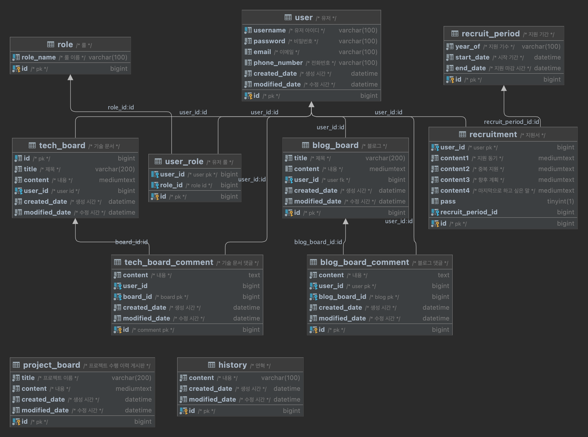

# Debug Web Api

## 기술 명세서

- 개발 환경 : ubuntu, macOS(arm)
- 개발 도구 : IntelliJ
- 사용 언어 : Java([openJDK 11 - zulu 11.0.15 LTS](https://www.azul.com/downloads/?package=jdk#download-openjdk))
- 데이터베이스 : Mysql(배포, 미정), H2 database(개발, 2.1.212)
- 라이센스 : MIT
- 백엔드 프레임워크 : Spring boot(2.7.1)
    - 프로젝트 빌드 도구 : gradle
    - 라이브러리 버전 목록()

```gradle
dependencies {
    implementation 'org.springframework.boot:spring-boot-starter-oauth2-client'
    implementation 'org.springframework.boot:spring-boot-starter-data-jpa:2.7.0'
    implementation 'org.springframework.boot:spring-boot-starter-security:2.7.0'
    implementation 'org.springframework.boot:spring-boot-starter-web:2.7.0'
    implementation 'io.jsonwebtoken:jjwt-impl:0.11.5'
    implementation 'io.jsonwebtoken:jjwt-api:0.11.5'
    implementation 'io.jsonwebtoken:jjwt-gson:0.11.5'
    compileOnly 'org.projectlombok:lombok:1.18.24'
    developmentOnly 'org.springframework.boot:spring-boot-devtools:2.7.0'
    runtimeOnly 'com.h2database:h2:2.1.212'
    runtimeOnly 'mysql:mysql-connector-java:8.0.29'
    annotationProcessor 'org.projectlombok:lombok:1.18.24'
    testImplementation 'org.springframework.boot:spring-boot-starter-test:2.7.0'
    testImplementation 'org.springframework.security:spring-security-test:5.7.1'
}
```

- 버전 관리 : git, [github](https://github.com/debug-2357/WEB_Backend)
    -
    전략 : [github-flow](https://subicura.com/git/guide/github-flow.html#github-flow-%E1%84%87%E1%85%A1%E1%86%BC%E1%84%89%E1%85%B5%E1%86%A8)
- 도메인 : 미정

## DB ERD

